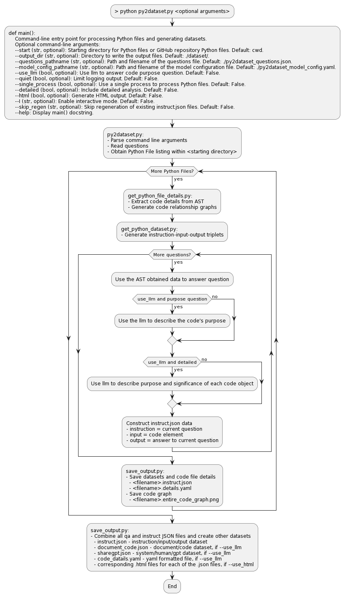

# py2dataset - Python to Dataset

py2dataset analyzes source code to generate structured datasets describing code content and behavior. It extracts information from Python files and converts it into JSON-formatted datasets. These datasets can help you understand Python software or train AI systems.



## Overview

py2dataset flexibly and extensibly analyzes source code to generate descriptive datasets for understanding and learning Python code.

py2dataset performs the following functions:

- Obtain questions from the `py2dataset_questions.json` file or from the questions filename provided in the command line
- Obtain a file listing of all of Python files within the provided directory and its subdirectories
- Parse each Python file using the **Abstract Syntax Tree (AST)** and **visitor design pattern** to build a representation of the code structure, functions, classes, methods and variables
- Generate information for the output datasets in instruction-input-output triplets using code snippets as context to answer the questions about the Python file characteristics
- (Optional) Invoke a **language model** to generate responses to questions about the purpose of each file, function, class, method, and variable
- Output `<filename>.instruct.json` datasets, and a `<filename>.details.yaml` containing the AST analysis to the local `./dataset` directory or the command line specified output directory 
- Create image of the **code call graph** for the functions and classes within each python file and save in the same output directory
- Combine the datasets for all individual Python files together to produce a final `instruct.json` and `instruct.html` the same output directory

## Installation 

### From Source

Clone the repository and install dependencies:

    ```bash
    git clone https://github.com/jeffmeloy/py2dataset.git
    pip install -r requirements.txt 
    ```

## Usage

### Command Line Interface

**Example usage:**
    
    ```bash
    python py2dataset.py <optional arguments>
    ```

**Optional arguments:**
- `--start_dir` (str, optional): Starting directory to search for Python files. Defaults to the current working directory.
- `--output_dir` (str, optional): Directory to write the output files. Defaults to the 'datasets' directory in the current working directory.
- `--questions_pathname` (str, optional): Path to the questions file. If not provided, defaults defined in 'get_py2dataset_params.py' will be used.
- `--model_config_pathname` (str, optional): Path to the model configuration file. If not provided, defaults defined in 'get_py2dataset_params.py' will be used.
- `--use_llm` (bool, optional): Use a Large Language Model for generating JSON answers. Defaults to False.
- `--quiet` (bool, optional): Limit logging output. If provided, only warnings and errors will be logged. Defaults to False.

## Questions for datasets

The following questions are answered by parsing the AST:
- What are the dependencies of the Python file: '{filename}'?
- What is the code call graph of the Python file: '{filename}'?
- What functions are defined in the Python file: '{filename}'?
- What classes are defined in the Python file: '{filename}'?
- What are the inputs to the function: '{function_name}' in the Python file: '{filename}'?
- What is the docstring of the function: '{function_name}' in the Python file: '{filename}'?
- What calls are made in the function: '{function_name}' in the Python file: '{filename}'?
- What variables are defined in the function: '{function_name}' in the Python file: '{filename}'?
- What are the returned items from the function: '{function_name}' in the Python file: '{filename}'?
- What are the methods defined within the class: '{class_name}' in the Python file: '{filename}'?
- What is the docstring of the class: '{class_name}' in the Python file: '{filename}'?
- What are the attributes of the class: '{class_name}' in the Python file: '{filename}'?
- What variables are defined in the class: '{class_name}' in the Python file: '{filename}'?
- What is the Inheritance of the class: '{class_name}' in the Python file: '{filename}'?
- What are the inputs to method: '{method_name}' in the class: '{class_name}' in the Python file: '{filename}'?
- What is the docstring of the method: '{method_name}' in the class: '{class_name}' in the Python file: '{filename}'?
- What calls are made in the method: '{method_name}' in the class: '{class_name}' in the Python file: '{filename}'?
- What are the returns from the method: '{method_name}' in the class: '{class_name}' in the Python file: '{filename}'?

The following questions are answered using a language model if --use_llm: 
- Describe the purpose and processing summary of the Python file: '{filename}; 2. Provide an itemized description of each applicable function, class, method with enough detail for me to implement the same logic; 3. Explain what each of input, output, and variable do within the file."

## Code Structure

- `py2dataset.py` - Main script
- `get_py2dataset_params.py` - Validates parameter path and file name arguments, returns questions and model
- `get_python_file_details.py` - Extracts details from Python files using AST
- `get_python_datasets.py` - Generates question-answer pairs and instructions
- `save_p2dataset_output.py` - Save the output datasets, optional graph images and .html files 
- `py2dataset_questions.json` - Standard questions for Python files, functions, classes
- `py2dataset_model_config.yaml` - Configuration for language model
    
## Language Model 

Currently configured to use [ctransformers](https://github.com/marella/ctransformers) with the default configuration defined in py2dataset_model_config.yaml

    ```yaml
    prompt_template: "\n### Instruction:\nGiven this context:\n'{context}'\nPlease analyze this AI generated code and respond without duplicating the input code and include your reasoning step by step: {query}\n### Response:"
    inference_model:
    model_import_path: "ctransformers.AutoModelForCausalLM"
    model_inference_function: "from_pretrained"
    model_params:
        model_path: "TheBloke/WizardCoder-Python-13B-V1.0-GGUF"
        model_type: "llama"
        local_files_only: false
        
        # other models that work with this prompt
        #model_path: "TheBloke/WizardCoder-Guanaco-15B-V1.1-GGML"
        #model_type: "gpt_bigcode"
        #local_files_only: false
        #model_path: "TheBloke/Starcoderplus-Guanaco-GPT4-15B-V1.0-GGML"
        #model_type: "gpt_bigcode"
        #local_files_only: false
        #model_path: "TheBloke/Octocoder-GGML"
        #model_type: "gpt_bigcode"
        #local_files_only: false  

        ## MODEL CONFIGURATION PARAMETERS (GPU 4090 - 24GB VRAM, CPU 5950x - 32 threads, 64GB RAM)
        #avx2 and gpu_layers are not compatible 
        #lib: "avx2"
        threads: 28
        batch_size: 512
        context_length: 8092
        max_new_tokens: 8092
        gpu_layers: 100
        reset: true
    ```

## Output

For each Python file assessed, the script saves the following to the output directory:

- `<filename>.details.yaml` - Python file details YAML file
- `<filename>.instruct.json` - Instructions JSON file
- `<filename>.entire_code_graph.png` - Code relationship graph (optional)
- `<filename>.instruct.json.html` - Instructions JSON file in .html format (optional)

The script then creates composite datasets by combining the files above and saves the following to the output directory:

- `instruct.json` - complete instruct dataset
- `instruct.html` - html formated file
- `train.json` - instruction/output dataset
                 a. instruction: Define the Python code that is described as follows: `file_purpose` / output: `Python file source code`
                 b. instruction: Define the call code graph for this Python source code: `Python file source code` / output: `entire_code_graph` 
- `train.html` - (optional, if use_llm) html formated file

If an output directory is not specified, the files will be saved in a ./datasets directory within the current working directory. If this directory does not exist, it will be created.

The ./example_datasets directory provided contains the py2dataset output generated on itself. 
    
    ```bash
    > python .\py2dataset.py --start_dir ..\ --use_llm
    ```
## Requirements

- Python >= 3.10
- **networkx** library for defining code graphs
- **ctransformers** library for large language model support
- **yaml** library for configuration and output files
- **matplotlib** library for saving code graphs
- **importlib** library for importing Python modules dynamically